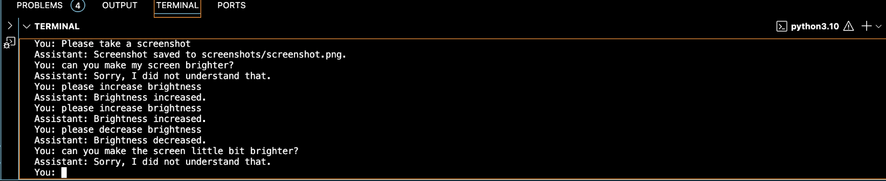
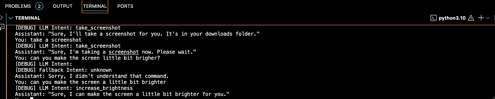

#  AI Desktop Assistant 

An intelligent offline desktop assistant built with Python that leverages a local LLM (Phi-2) for natural language understanding and control. The assistant can understand user commands and perform system-level actions such as:

-  Increasing brightness
-  Decreasing brightness
-  Taking screenshots

Used LLM is **Phi-2.Q4_K_M.gguf** (lightweight local model) and `langchain`.

---

## WHY LLMS USED HERE?
 we can implement this task by simple mapping (direct mapping) so when we use this kind of implementation there is no need for LLMs, here the system directly look for some keywords like "increase" and "brightness", based on that keyword it performs the task. The drawback of this implementation is that the model become very constraint for example: To increasing the brightness the only one command is " Please increase the brightness" so the model(system) looks for the keyword "increase and brightness" but whenever the user input is like  "can you make the screen a little bit brighter", this system fails beacuse there is no keywords.
 ## SO LLM IS USED HERE TO UNDERSTAND THE NATURAL LANGUAGE AND PERFORM TAKS ACCORDINGLY.

##  Features

-  **Runs fully offline** – No internet required
-  **LLM-based intent classification**
-  Screenshot functionality
-  Brightness control (macOS-only using AppleScript) #since i m using mac (if you are using windows try its command)
-  Uses [Phi-2](https://huggingface.co/microsoft/phi-2) model via `llama-cpp-python`

---

## WITHOUT LLM (please look the last few lines)

## WITH LLM (please look the last few lines)

